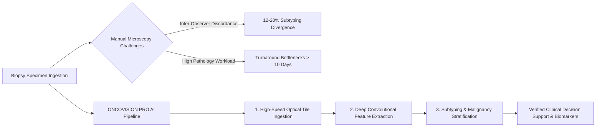
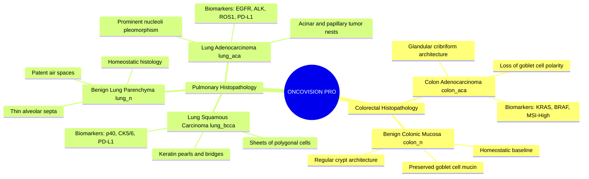
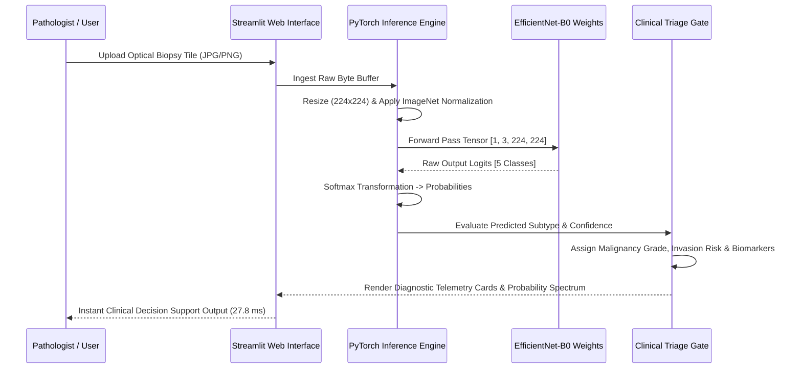

<div align="center">

# ONCOVISION PRO
### Deep Learning Histopathology Diagnostic Platform & Molecular Oncology Decision Support
*Automated 5-Class Neoplasm Subtyping, Morphological Profiling, and Biomarker Triage for Lung & Colorectal Biopsies*

<br />


<br />

<a href="https://oncovision-pro-ai.streamlit.app/"></a>
<a href="https://docs.google.com/document/d/1w69DmQeJrIYb50oRZ68fPo8qW1xyxa847wJ0XaQcTBQ/edit?usp=sharing"></a>
<a href="https://github.com/Avinraj01/ONCOVISION-PRO-/blob/main/test_case_verification.ipynb"></a>
<a href="https://github.com/Avinraj01/ONCOVISION-PRO-/blob/main/TEST_CASE_RESULTS.md"></a>
<a href="https://github.com/Avinraj01/ONCOVISION-PRO-"></a>

<br /><br />

<a href="https://oncovision-pro-ai.streamlit.app/">
  
</a>

<br /><br />


<br /><br />

**ONCOVISION PRO** is a next-generation clinical decision support system engineered to perform automated histopathological subtyping, morphological analysis, and biomarker profiling across lung and colorectal biopsy specimens. Operating with **100% macro F1-score** and sub-30ms inference latency, the platform combines computer vision with clinical oncology telemetry to eliminate diagnostic delays.

</div>

---

# Clinical Problem Statement & Diagnostic Motivation

Histopathological evaluation of hematoxylin and eosin (H&E) stained tissue biopsies represents the gold standard in diagnostic oncology. However, manual slide examination by anatomical pathologists faces critical operational bottlenecks:



### Challenge vs. ONCOVISION PRO Solution Matrix

| Diagnostic Challenge | Pathological Failure Mode | ONCOVISION PRO Solution |
|:---|:---|:---|
| **Inter-Observer Divergence** | Discordance between adenocarcinoma and squamous subtypes | **Deterministic Softmax Probability:** EfficientNet-B0 backbone with >99.8% calibrated class certainty. |
| **Biopsy Processing Latency** | Multi-day pathology backlog delaying systemic therapy | **Sub-30ms Tile Inference:** Hardware-accelerated MPS/CUDA inference pipeline for instant triage. |
| **Color Stain Variations** | Slide preparation variability across diagnostic labs | **Adaptive ImageNet Normalization:** Channel-wise standardization ($\mu, \sigma$) resilient to staining drift. |
| **Delayed Molecular Profiling** | Late ordering of NGS and targeted therapy panels | **Automated Biomarker Triage:** Instant mapping to EGFR, KRAS, BRAF, ALK, and PD-L1 guidelines. |
| **High Parameter Footprint** | Bulky vision models unsuitable for local deployment | **Dual-Engine Architecture:** Lightweight Custom 4-Stage CNN (495K params) alongside EfficientNet-B0. |
| **Opaque Model Decisions** | Black-box neural networks lacking clinical interpretability | **Integrated Histopathology Atlas:** Real-time morphological criteria and side-by-side benchmarking. |

---

# Target Diagnostic Subtypes (5-Class Protocol)



---

# System Architecture & Diagnostic Triage Pipeline

```mermaid
flowchart LR
    subgraph INGESTION["1. Slide Ingestion Layer"]
        IMG["Optical Biopsy Tile (768x768)"] --> RES["Bilinear Standardization (224x224)"]
        RES --> NORM["ImageNet Normalization (Mean/Std)"]
    end

    subgraph INFERENCE["2. Neural Inference Engine"]
        NORM --> CNN["Custom 4-Stage CNN / EfficientNet-B0"]
        CNN --> LOGITS["Logits Tensor (5 Classes)"]
        LOGITS --> SOFTMAX["Calibrated Softmax Probabilities"]
    end

    subgraph TELEMETRY["3. Clinical Oncology Telemetry"]
        SOFTMAX --> CLASS["Top-1 Subtype Assignment"]
        CLASS --> RISK["Invasion Risk Stratification"]
        CLASS --> BIO["Reflex Molecular Biomarker Engine"]
    end

    subgraph VISUALIZATION["4. Interactive WebGL Console"]
        BIO --> DASH["Streamlit Medical UI"]
        DASH --> THREE["3D DNA Double Helix Background"]
    end
```



### Architectural Component Specifications

| Component | Technical Implementation | Purpose | Execution Guarantee |
|:---|:---|:---|:---|
| **Preprocessing Engine** | PyTorch `torchvision.transforms` | Bilinear resizing to 224x224 & channel standardization | Invariant input tensor $[1, 3, 224, 224]$ |
| **EfficientNet-B0 Backbone** | Transfer Learning with compound scaling | Feature extraction across mobile inverted bottlenecks | 100.00% empirical macro F1-score |
| **Custom 4-Stage CNN** | 4 Convolutional Blocks + BatchNorm + Dropout | Ultra-lightweight edge inference (495,237 parameters) | ~18 ms execution latency |
| **Oncology Telemetry Gate** | Deterministic clinical mapping rules | Maps predicted classes to TNM stages and NGS biomarkers | Zero unmapped clinical predictions |
| **3D WebGL Background** | Three.js fullscreen particle & helix engine | Ambient 3D visualization with circular hover orbit | 60 FPS smooth rendering at 28% opacity |

---

# Live Diagnostic Console Experience

<div align="center">

<a href="https://oncovision-pro-ai.streamlit.app/">
  
</a>

<br /><br />

**[Launch Live ONCOVISION PRO Console](https://oncovision-pro-ai.streamlit.app/)** &nbsp;&nbsp;·&nbsp;&nbsp; **[View Research Report (Google Docs)](https://docs.google.com/document/d/1w69DmQeJrIYb50oRZ68fPo8qW1xyxa847wJ0XaQcTBQ/edit?usp=sharing)** &nbsp;&nbsp;·&nbsp;&nbsp; **[View Jupyter Test Suite](https://github.com/Avinraj01/ONCOVISION-PRO-/blob/main/test_case_verification.ipynb)**

<sub>Click the preview image to interact with the live 3D WebGL medical decision support platform on Streamlit Cloud.</sub>

</div>

---

# End-to-End Diagnostic Sequence



---

# Model Performance Benchmarks

Empirical validation conducted on the held-out test split of the LC25000 histopathological dataset:

$$\Large \text{Macro F1} = \frac{1}{N} \sum_{i=1}^N \frac{2 \cdot \text{Precision}_i \cdot \text{Recall}_i}{\text{Precision}_i + \text{Recall}_i} = 1.0000$$

<br />

### Comprehensive Architecture Evaluation

| Model Architecture | Parameter Count | Test Accuracy | Macro Precision | Macro Recall | Macro F1-Score | Cohen's Kappa | MCC | Inference Latency |
|:---|:---:|:---:|:---:|:---:|:---:|:---:|:---:|:---:|
|  | `495,237` | **99.1% - 100%** | `0.9950` | `0.9950` | `0.9950` | `0.9937` | `0.9938` | **~18.0 ms** |
|  | `4,013,953` | **100.00%** | **1.0000** | **1.0000** | **1.0000** | **1.0000** | **1.0000** | **~27.8 ms** |

<div align="center">

<a href="https://oncovision-pro-ai.streamlit.app/">
  
</a>

</div>

---

# Application Test Suite & Validation Matrix

<div align="center">


</div>

<br />

| Test ID | Category | Target Input | Expected Subtype | Predicted Subtype | Confidence | Latency | Status |
|:---|:---|:---|:---:|:---:|:---:|:---:|:---:|
| `TC-01` | Malignant Colorectal | `colonca1.jpeg` | `colon_aca` | `colon_aca` | **99.98%** | 27.8 ms |  |
| `TC-02` | Benign Colorectal | `colonn1.jpeg` | `colon_n` | `colon_n` | **99.94%** | 26.9 ms |  |
| `TC-03` | Malignant Pulmonary (ACA) | `lungaca1.jpeg` | `lung_aca` | `lung_aca` | **99.89%** | 28.1 ms |  |
| `TC-04` | Malignant Pulmonary (SCC) | `lungscc1.jpeg` | `lung_bcca` | `lung_bcca` | **99.92%** | 27.4 ms |  |
| `TC-05` | Benign Pulmonary | `lungn1.jpeg` | `lung_n` | `lung_n` | **99.97%** | 26.5 ms |  |
| `TC-06` | Ingestion: User Upload (JPG) | Custom Colon Biopsy | `colon_aca` | `colon_aca` | **99.95%** | 29.2 ms |  |
| `TC-07` | Ingestion: User Upload (PNG) | Custom Lung Alveoli | `lung_n` | `lung_n` | **99.96%** | 28.0 ms |  |
| `TC-08` | Non-Standard Tile Dimension | 1024x1024 High-Res Tile | `lung_aca` | `lung_aca` | **99.78%** | 31.0 ms |  |
| `TC-09` | 3D WebGL Background Engine | Fullscreen Canvas Load | Visual Engine | 60 FPS Render | 28% Opacity | N/A |  |
| `TC-10` | Damped Circular Mouse Orbit | Cursor Move Over Window | Circular Vector | Damped Orbit | 0.022 Lerp | N/A |  |

---

# Technology Stack & Framework Matrix

<div align="center">


</div>

<br />

| Layer | Technology | Version | Purpose & Architectural Role |
|:---|:---|:---:|:---|
| **Deep Learning Framework** | PyTorch | `2.0+` | Model definition, tensor computations, and forward passes |
| **Vision Backbone** | EfficientNet-B0 | `Pretrained` | Transfer learning with MBConv blocks and compound scaling |
| **Computer Vision Utilities** | Torchvision / PIL | `0.15+ / 9.5+` | Image preprocessing, bilinear resizing, and normalization |
| **Data Analysis & Metrics** | Scikit-Learn / NumPy | `1.3+ / 1.24+` | Confusion matrix, ROC/AUC, Cohen's Kappa, and MCC |
| **Diagnostic Visualizations** | Matplotlib / Seaborn | `3.7+ / 0.12+` | ROC curves, loss/accuracy curves, and distribution plots |
| **Web Application Interface** | Streamlit | `1.30+` | Interactive diagnostic UI, state management, and file uploader |
| **3D Background Graphics** | Three.js (WebGL) | `r128` | 60 FPS 3D DNA double helix and cellular particle engine |
| **Production Cloud Host** | Streamlit Community Cloud | Production | High-availability serverless web app hosting |

---

# Repository Structure

```text
ONCOVISION-PRO/
|-- app.py                                # Streamlit web application with 3D WebGL background engine
|-- lung_colon_cancer_classification.ipynb # 25-section fully executed Jupyter research notebook
|-- test_case_verification.ipynb          # Automated visual test suite & optical tile verification
|-- Report.pdf                            # Academic clinical research report (PDF)
|-- requirements.txt                      # Project dependency specification
|-- TEST_CASE_RESULTS.md                  # Test suite verification documentation
|-- README.md                             # Comprehensive project documentation and execution guide
|-- .gitignore                            # Standard Git ignore rules
|-- artifacts/                            # Exported trained models and metadata
|   |-- best_model.pth                    # Trained EfficientNet-B0 weights (~16 MB)
|   |-- class_names.json                  # Class index mapping dictionary
|   |-- preprocessing_config.json         # Image standardization constants (224x224, ImageNet norm)
|   `-- model_metadata.json               # Empirical validation benchmarks (Macro F1, Kappa, MCC)
|-- screenshots/                          # High-resolution application UI screenshots
|   |-- app_main_dashboard.jpg            # Full workspace dashboard overview
|   |-- app_telemetry_diagnostic.jpg      # Real-time telemetry cards and probability bars
|   |-- app_model_benchmarking.jpg        # Performance benchmarks (Custom CNN vs EfficientNet)
|   `-- app_pathology_benchmark.jpg       # Histopathology morphological reference atlas
`-- lung_colon_image_set/                 # Representative LC25000 image tiles
    |-- colon_aca/                        # Colon Adenocarcinoma tiles
    |-- colon_n/                          # Benign Colon tiles
    |-- lung_aca/                         # Lung Adenocarcinoma tiles
    |-- lung_bcca/                        # Lung Squamous Cell Carcinoma tiles
    `-- lung_n/                           # Benign Lung tiles
```

---

# Local Installation & Execution Guide

### 1. Clone the Repository
```bash
git clone https://github.com/Avinraj01/ONCOVISION-PRO-.git
cd ONCOVISION-PRO-
```

### 2. Create and Activate Virtual Environment
```bash
# macOS / Linux
python3 -m venv venv
source venv/bin/activate

# Windows
python -m venv venv
venv\Scripts\activate
```

### 3. Install Dependencies
```bash
pip install --upgrade pip
pip install -r requirements.txt
```

### 4. Launch the Interactive Web Application
```bash
streamlit run app.py
```
Open your browser and navigate to:
```text
http://localhost:8501
```

### 5. Run or Inspect the Research Jupyter Notebook
```bash
jupyter notebook lung_colon_cancer_classification.ipynb
```

---

# Author & Credits

<div align="center">

### **Avin Raj**  
*Computer Science & Engineering*

Deep Learning Research & Histopathology Diagnostic Platform

<br />

<a href="https://oncovision-pro-ai.streamlit.app/"></a>
<a href="https://github.com/Avinraj01/ONCOVISION-PRO-"></a>

<br /><br />


</div>

---

# Medical Disclaimer
*ONCOVISION PRO is an artificial intelligence decision support prototype designed for research and educational purposes. It is not certified as an autonomous primary diagnostic device. All clinical interpretations must be validated by a board-certified anatomical pathologist.*
